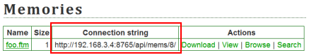

.. index:: Felix

Connecting from Felix
========================

On the **Memories** or **Glossaries** page, you'll find a list of memories/glossaries available from memories serves, each of which has an associated connection string:

Copy the connection string of the desired TM/glossary, then from the Felix **File** menu, select **Connect...**, and paste in that connection string. The server memory/glossary should behave just like a local one, except that you don't need to save it (the server takes care of that automatically).
