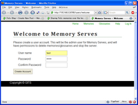
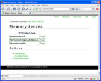

Getting Started
==================

Memory Serves is a free translation-memory (TM) server. It lets you share Felix translation memories and glossaries over your local network (LAN). You can also share them remotely using a VPN.

Memory Serves allows multiple translators to share their TMs/glossaries in real time. Translations added to the memory by one translator are available to the other translators instantly.

How It Works
---------------

Memory Serves works by starting a Web server on your local machine using the open-source `cherrypy <http://www.cherrypy.org/>`_ framework. This server is visible within your LAN or VLAN only; it's not visible to the entire Internet. The IP address it uses is that of your own computer.

Download
-------------

Download `Memory Serves <http://felix-cat.com/tools/memory-serves/>`_ and install it. When you first launch Memory Serves, it'll prompt you to create an admin account. You'll need to be logged in as an administrator to delete TMs/glossaries or shut down the server.

Add Memories and Glossaries
------------------------------

Once you have Memory Serves installed and running, get some TMs/glossaries loaded into the server. You can either upload existing Felix memories, or create new ones. See the Help link in the Memory Serves program for details.

You can also configure the search preferences if you like. See the Help link in the Memory Serves program for details.

See :doc:`web-interface` for details.

Connect to a Memory or Glossary
----------------------------------

To connect to a memory or glossary from Felix, get the connection string for the TM/glossary
in question, and specify this in the Felix window.

See :doc:`connecting-from-felix` for details.
