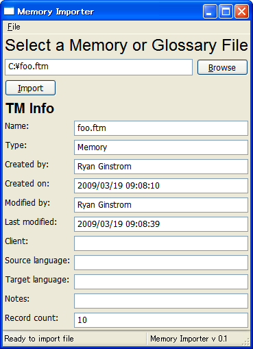

.. index:: Memory Importer

Memory Importer
=================

Version 1.2 of Memory Serves and above includes a stand-alone program called Memory Importer:

Uploading large memories or glossaries to Memory Serves would sometimes cause a time out error; you can use this application to import your translation memory (.ftm/.xml) and glossary (.fgloss/.xml) files into Memory Serves, without worrying about time outs.

Note that Memory Serves must not be running when you use Memory Importer, because Memory Importer modifies the database on disk. If you try starting Memory Importer while Memory Serves is running, an error message will appear, and the program will quit immediately.

To launch Memory Importer, go to the **Start** menu, then select **All Programs** >> **Memory Serves** >> **Memory Importer**.

Next, simply select a memory or glossary file, then click **Import**. You can also edit the meta information about the memory, such as the source language, creator, or client, or add notes about the memory.

**Note**: You have to run Memory Importer on the computer where Memory Serves is installed. It can't import memories over the network (yet).
